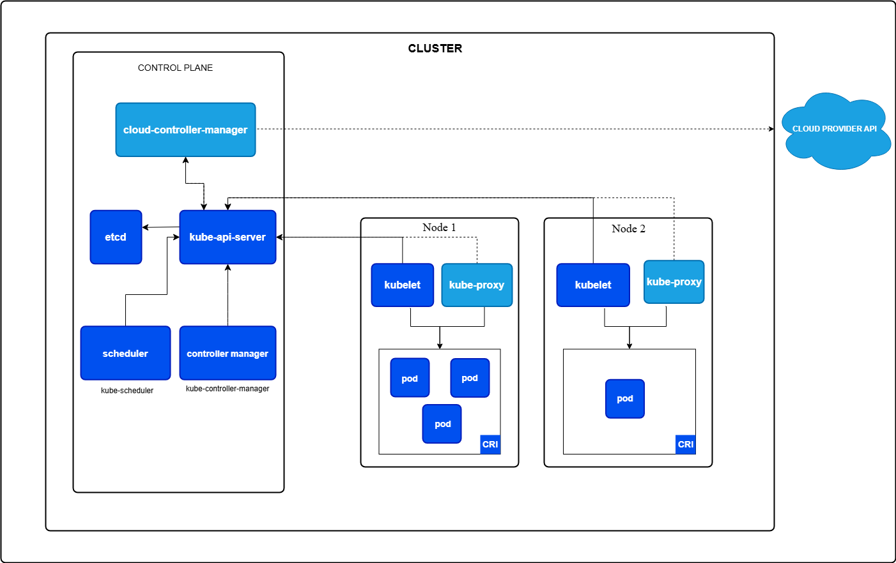

# Overview

# 概念
## 提问：deployment和statefulset有什么不同
statefulset中每个pod有一个稳定的名称（例如my-app-0,my-app-1）和网络标识（my-app-0.my-service），即便重建也保持一致，同时每个pod拥有独立的PersistentVolume. 也就是说statefulset很适合用来做数据库集群，数据库集群通常需要分片，和复制，多主等需求，这个刚好符合statefulset的定义。

# Best Practive

# 阅读
